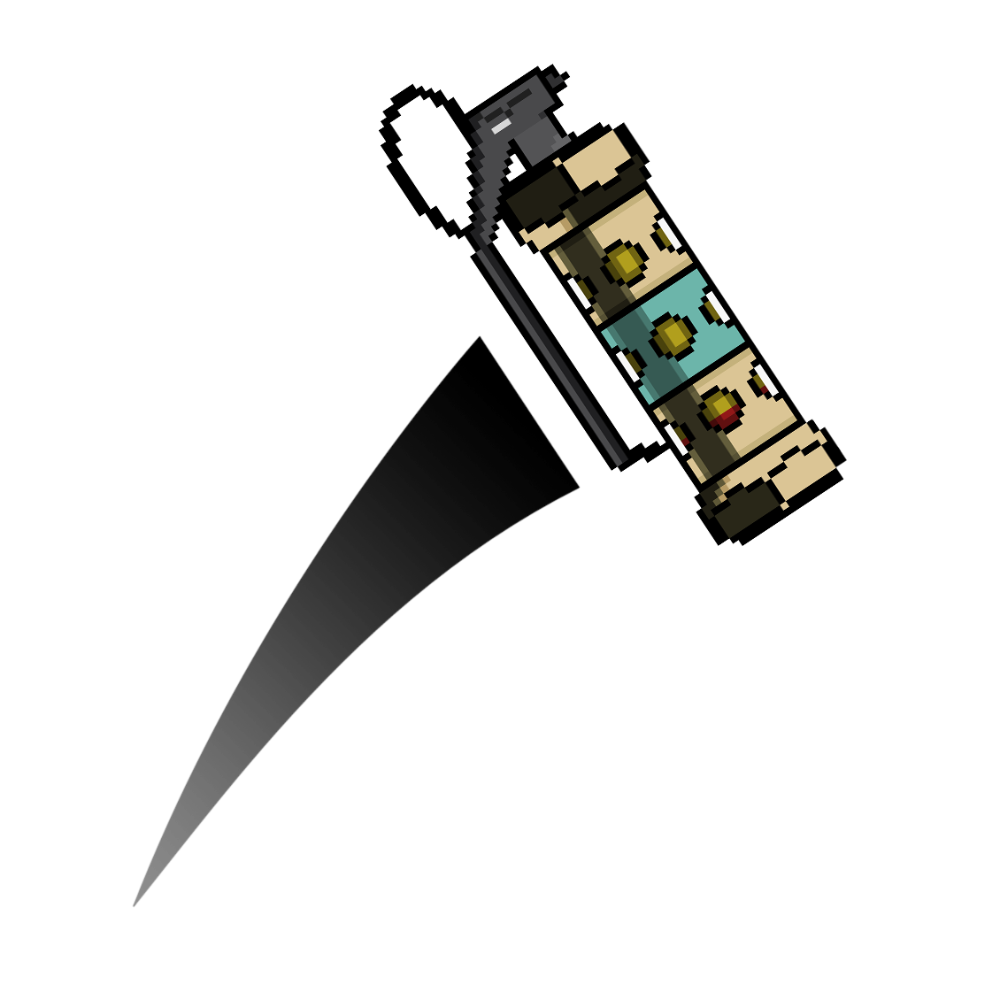

# Flashboost Macro

A Flashboost macro complete with GUI, made for cs:s Trikz.

<h3> Installation </h3>

 - Download the latest PFM folder, and extract it to anywhere on your computer.
 - If you want the version which launches the macro when you release left mouse click, download "PFM - On Mouse Release"
 - Double click the "FlashMacro.exe" file to launch the macro.
 
<h3> How does it work? </h3/>
 
 - When the macro is activatied, it will change both left and right click on your mouse. 
 - Left click will launch the Jumpboost macro, which immedeately releases left click after you press it, and then presses the spacebar after the "Flashdelay" is completed.
 - Right click works as your left click would have without the macro, this way you can still throw flashbangs without jumping.

<h3> Antivirus </h3>

 - Due to the nature of how this macro works, most antiviruses will recognize it as a keylogger. This is because the macro is listening for mouse click inputs. You should allow/whitelist the exe file in your antivirus, so that it does not remove the macro, as this is a false positive.

The software doesn't alter any gamefiles, and is completely separate from any other applications.

<b>
*NOTE*: I am not responsible for any consequenses you might get from using the macro, as with any other macro available.
</b>
